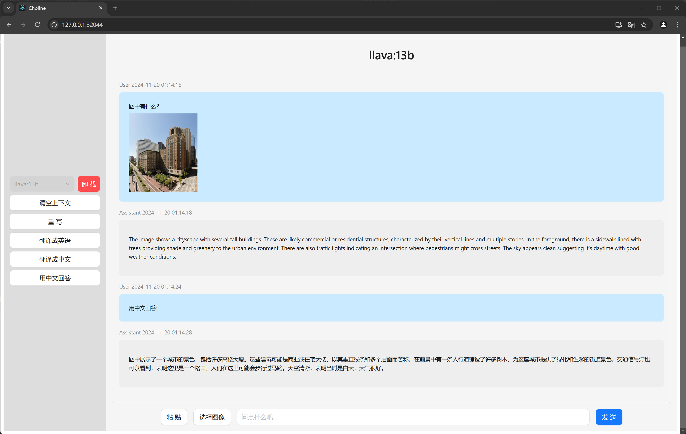

# Choline
一个简单的适配Ollama的Web UI；支持多模态大模型。

## 使用
0. 准备Ollama和Python3；在Python3中安装```aiohttp```、```aiofiles```和```requests```。
```sh
pip3 install aiohttp aiofiles requests
```
1. 下载```release.zip```并解压。
2. 在解压目录下运行main.py。
```sh
python3 main.py
```
3. 启动Ollama并访问 http://127.0.0.1:32044 ，UI is ready!

## 特性
✅ 多模态（图像）支持  
✅ 无需Docker，部署简单  
✅ 中文界面  

❌︎ 没有对话历史记录  
❌︎ 没有英语界面  

### 运行截图


## 配置项
```main.py```开头部分有可配置参数：
```python3
ALLOW_IP_ADDRESS = ['127.0.0.1']  # 允许访问的IP地址列表
SERVER_PORT = 32044  # 提供网页的服务器端口
OLLAMA_PORT = 11434  # Ollama API端口
```


## 从源码构建
0. 准备nodejs、Ollama和Python3；在Python3中安装```aiohttp```、```aiofiles```和```requests```。
1. 在终端中切换工作目录到```./choline_frontend```，执行```npm install ```或者```cnpm install```安装依赖包。
```sh
cnpm install
```
2. 运行```npm run build```构建前端，执行结束后会在当前目录下生成```build```目录。
```sh
npm run build
```
3. 将```build```目录拷贝到```./website```下。
4. 在解压目录下运行main.py。
```sh
python3 main.py
```
5. 启动Ollama并访问 http://127.0.0.1:32044 ，UI is ready!

## 开源代码使用
* React
* Ant Design
* Axios
* Highlight.js
* lucide-react
* react-markdown
* rehype-highlight
* Python3


\* 项目中存在 AI 生成的代码。  
欢迎PR。